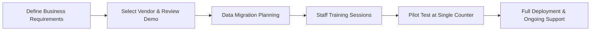

# How SadaHisab’s Pharmacy Management System Boosts Efficiency for Rawalpindi Drugstores

Pharmacy owners in Rawalpindi face the daily challenge of balancing accurate stock control, fast prescription processing, and strict regulatory compliance while keeping profit margins healthy. Selecting the right technology platform is the pivotal decision that determines whether the business can scale, reduce errors, and satisfy both patients and auditors. The right Pharmacy Management System in Rawalpindi can make routine reconciliation easier by giving managers one consistent view of sales and stock activity.

---

## The Operational Pain Points Specific to Rawalpindi Drugstores  

Rawalpindi’s pharmacy market is dense, with small independent stores competing alongside larger chains. Common operational bottlenecks include:

1. **Manual batch and expiry tracking** – Leads to expired medicines being sold inadvertently, exposing the shop to fines from the Drug Regulatory Authority of Pakistan (DRAP).  
2. **Fragmented sales channels** – Counter sales, home delivery, and corporate supply contracts often use separate registers, resulting in duplicate data entry.  
3. **Inconsistent credit management** – Many pharmacies extend “Udhaar” to regular customers without a systematic way to record, follow up, or enforce repayment.  
4. **Limited reporting** – Owners rely on ad‑hoc Excel sheets, which cannot provide real‑time profit‑and‑loss statements or tax‑ready GST summaries.  
5. **Staff scheduling and payroll** – Without digital attendance, overtime is miscalculated, and payroll errors erode employee trust.

Each of these issues can be mitigated by a well‑configured Pharmacy Management System in Rawalpindi integrates POS billing, inventory, and compliance modules under a single cloud‑based dashboard. In practice, the value of Pharmacy Management System in Rawalpindi depends on whether staff can use it consistently during busy operating hours.

---

## Core Features Pharmacy Management System in Rawalpindi Must Provide  

When evaluating solutions, focus on functional modules that directly address the listed pain points.

### 1. Integrated POS Billing with Prescription Scanning  

A barcode‑enabled POS accelerates the checkout process. Prescription QR codes or barcodes can be scanned, auto‑populating drug names, dosage, and price. This reduces transcription errors and speeds up service for patients waiting in line.

### 2. Batch, Expiry, and Serial Number Management  

The system should record batch numbers at purchase, link them to expiry dates, and trigger low‑stock or near‑expiry alerts. Automatic removal of expired items from the sellable inventory keeps the pharmacy compliant with DRAP guidelines. A useful implementation plan for Pharmacy Management System in Rawalpindi starts with a small set of products and transactions that staff can verify end to end.

### 3. Multi‑Branch Stock Consolidation  

For owners operating multiple outlets across Rawalpindi, real‑time central inventory visibility prevents over‑stocking at one location while another faces stock‑outs. Transfer requests can be generated directly from the dashboard. When evaluating Pharmacy Management System in Rawalpindi, teams should look beyond the interface and confirm how it handles daily sales, stock changes, and reporting.

### 4. Credit (Udhaar) Management and Customer Ledger  

A dedicated credit module records each Udhaar transaction, sets repayment terms, and sends SMS reminders. It also generates aging reports that help the owner assess credit risk.

### 5. Comprehensive Reporting and Analytics  

Daily sales, profit margins per product, GST calculations, and inventory turnover rates must be available as downloadable PDFs or Excel files. Advanced analytics can highlight top‑selling therapeutic categories, enabling smarter procurement. A well-planned rollout of Pharmacy Management System in Rawalpindi gives staff time to practise common sales and correction workflows before the system handles full volume.

### 6. Attendance, Payroll, and Staff Access Controls  

Biometric or RFID attendance integrates with payroll, ensuring accurate wage calculations. Role‑based access prevents cashiers from altering purchase prices or deleting sales records.

### 7. API and E‑Commerce Integration  

Rawalpindi pharmacies increasingly sell via WhatsApp or dedicated e‑commerce portals. Open APIs allow order data to flow into the core system, keeping on‑hand stock synchronized across channels. The onboarding effort for Pharmacy Management System in Rawalpindi is worthwhile when the team can explain what happens to a product, order, and payment at each step.

SadaHisab’s platform includes all of these modules, eliminating the need for separate third‑party tools.

---

## Why SadaHisab Stands Out for the Pharmacy Management System in Rawalpindi Cloud‑First Architecture with Local Data Redundancy  

Rawalpindi’s internet reliability varies by area. SadaHisab stores encrypted backups on regional servers, ensuring uninterrupted access even during brief connectivity lapses.

### Customizable Drug Catalog and Regulatory Fields  

The system allows pharmacy owners to import a master drug list, then add DRAP‑required fields such as Schedule classification, controlled‑substance flags, and mandatory warning labels. This level of customization is rarely available in generic POS packages.

### Built‑In Loyalty and CRM for Repeat Customers  

Pharmacies can create loyalty points tied to specific brands or therapeutic classes. The CRM tracks patient purchase history, enabling targeted health‑awareness campaigns (e.g., flu‑shot reminders) while respecting privacy regulations.

### Seamless Integration with Existing Accounting Software  

Through native APIs, SadaHisab can push daily financial summaries to popular accounting tools used in Pakistan, simplifying tax filing and audit preparation.

### Scalable Pricing Model  

The pricing‑plan page outlines tiered subscription levels based on the number of active users and branches. Small independent pharmacies can start with the “Starter” plan and scale as they add new locations.

For a detailed cost breakdown, visit the **[pricing plans]**(https://sadahisab.com/pricing-plan/) page or **[Book a free demo]**(https://sadahisab.com/contact-us/) to see the system in action.

---

## Implementation Checklist: From Selection to Full Roll‑Out  

A structured rollout minimizes disruption to daily operations. Follow these steps when adopting Pharmacy Management System in Rawalpindi. The strongest case for Pharmacy Management System in Rawalpindi is a measurable improvement in how quickly teams move from a sale to an accurate stock update.

### Step 1 – Define Business Requirements  

- List all product categories (OTC, prescription, medical devices).  
- Quantify daily transaction volume to size hardware (receipt printer, barcode scanner).  
- Identify compliance checkpoints (batch tracking, GST invoicing).  

### Step 2 – Vendor Evaluation  

- Request a live demo focused on prescription entry and expiry alerts.  
- Verify that the system supports Urdu and English interfaces, crucial for Rawalpindi staff.  
- Confirm data residency policies align with local regulations.

### Step 3 – Data Migration  

- Export current inventory from Excel or legacy software.  
- Map columns to SadaHisab fields (e.g., “Batch No.” → “BatchID”).  
- Perform a test import for 10% of SKUs, validate pricing, then complete full migration.

### Step 4 – Staff Training  

- Conduct role‑specific sessions: cashiers learn POS shortcuts; managers learn reporting dashboards; pharmacists practice batch verification.  
- Provide a quick‑reference guide printed in both Urdu and English.

### Step 5 – Pilot Test  

- Run the system at one checkout for two weeks.  
- Track key metrics: average checkout time, inventory discrepancy rate, and user error incidents.  
- Adjust configuration based on feedback (e.g., modify barcode format for local suppliers).

### Step 6 – Full Deployment  

- Deploy the solution across all counters and branches.  
- Enable automatic low‑stock alerts to the purchasing manager’s phone.  
- Set up a recurring support call with SadaHisab’s implementation team for the first 30 days.

By adhering to this checklist, pharmacy owners can achieve a smooth transition without sacrificing sales during peak hours.

---

## Compliance and Regulatory Alignment for Rawalpindi Pharmacies  

The Drug Regulatory Authority of Pakistan (DRAP) requires pharmacies to maintain accurate records of controlled substances, batch numbers, and expiry dates. A competent Pharmacy Management System in Rawalpindi

1. **Log every receipt of controlled drugs** with supplier name, batch, and quantity.  
2. **Generate audit‑ready reports** that can be exported in PDF or CSV format for DRAP inspections.  
3. **Maintain a tamper‑evident audit trail** for price changes and stock adjustments.  

SadaHisab automatically timestamps each transaction, stores user IDs, and produces a “Regulatory Compliance” report that aligns with DRAP’s 2022 guidelines (see the official DRAP site for reference: https://www.drap.gov.pk). This eliminates the need for separate compliance spreadsheets and reduces the risk of penalties.

---

## Calculating Return on Investment (ROI) for Pharmacy Management System in Rawalpindi  

Investing in software should be justified with measurable financial benefits. Use the following framework:

| Parameter | Typical Pre‑Implementation Value | Expected Post‑Implementation Improvement | Monetary Impact (PKR) |
|-----------|----------------------------------|------------------------------------------|-----------------------|
| Average checkout time (seconds) | 90 | ↓ 30% (≈ 63 seconds) | Labor cost reduction ≈ 120,000/yr |
| Stock loss due to expiry | 2% of inventory value | ↓ 70% (to 0.6%) | Savings ≈ 300,000/yr |
| Manual accounting hours | 15 hrs/week | ↓ 80% (to 3 hrs) | Savings ≈ 250,000/yr |
| Credit collection delay | 45 days avg. | ↓ to 20 days | Improved cash flow ≈ 400,000/yr |
| **Total Annual Savings** | — | — | **≈ 1,070,000 PKR** |

Subtract the annual subscription cost (e.g., PKR 150,000 for the Starter tier) to obtain a net positive ROI within the first year. These figures are illustrative; actual results depend on the pharmacy’s size and operational discipline.

---

## Frequently Asked Questions  

**1. Can the system handle multiple languages for prescriptions?**  
Yes. SadaHisab supports Urdu, English, and Arabic character sets, enabling seamless entry of prescriptions written in any of these languages.

**2. What hardware is required for barcode scanning?**  
A basic USB barcode scanner and a thermal receipt printer are sufficient. The platform also works with Bluetooth scanners for mobile counters.

**3. How does the system manage GST on pharmacy sales?**  
GST is automatically applied based on product category. The system generates GST‑compliant invoices and provides a monthly GST summary ready for filing with the Federal Board of Revenue (FBR).

**4. Is data stored locally or in the cloud?**  
Data resides in a secure, encrypted cloud environment with daily backups on a regional server in Pakistan, ensuring both accessibility and data sovereignty.

**5. What support options are available after deployment?**  
SadaHisab offers 24/7 chat support, a dedicated account manager for pharmacies, and on‑site assistance for the first two weeks post‑deployment.

---

## Decision Matrix: Choosing the Pharmacy Management System in Rawalpindi  

| Criteria | SadaHisab | Generic POS (e.g., basic retail) | Manual Process |
|----------|-----------|-----------------------------------|----------------|
| Batch & Expiry Tracking | Automated with alerts | Manual entry, high error risk | None |
| Credit (Udhaar) Management | Integrated ledger & reminders | Separate spreadsheet | Paper ledger |
| Multi‑Branch Sync | Real‑time cloud sync | Limited or none | Physical stock checks |
| Compliance Reporting | DRAP‑ready audit trails | Requires custom scripts | Not available |
| Scalability | Tiered pricing, API access | Fixed feature set | Not applicable |
| Implementation Support | Dedicated onboarding team | Vendor support only | Self‑managed |
| Total Cost of Ownership (Year 1) | Moderate (subscription) | Low upfront, high hidden labor | High labor cost |

The matrix demonstrates that a specialized Pharmacy Management System in Rawalpindi SadaHisab delivers measurable advantages over generic or manual alternatives, especially in regulatory compliance and credit handling. The transition to Pharmacy Management System in Rawalpindi should include checks for duplicate products, inconsistent prices, and missing stock before live orders are enabled.

---

## Next Steps for Rawalpindi Pharmacy Owners  

1. **Audit current workflows** – Identify bottlenecks in inventory, billing, and credit handling.  
2. **Schedule a live demo** – Use the “Book a free demo” link to see the system process a typical prescription.  
3. **Run a pilot** – Deploy the solution at one counter for two weeks to validate speed gains and error reduction.  
4. **Finalize pricing** – Review the tiered options on the pricing‑plan page and select the plan that matches the number of users and branches.  
5. **Launch full rollout** – Follow the implementation checklist, train staff, and monitor key performance indicators weekly for the first month.

By following these steps, pharmacy owners can transition from fragmented manual processes to an integrated, compliant, and data‑driven operation that supports growth in Rawalpindi’s competitive market.

---

## Related Resources

- [Pos Software For Gym](https://sadahisab.com/industries/pos-software-for-gym/)
- [Best Pos Software For Stationery Shops](https://sadahisab.com/industries/best-pos-software-for-stationery-shops/)
- [Pos Software For Auto Spare Parts](https://sadahisab.com/industries/pos-software-for-auto-spare-parts/)
- [Pos Software For Electronics Shop](https://sadahisab.com/industries/pos-software-for-electronics-shop/)
- [Point of sale (Wikipedia)](https://en.wikipedia.org/wiki/Point_of_sale)
- [FBR official website](https://www.fbr.gov.pk/)
- [SRB official website](https://srb.gos.pk/)

## Conclusion  

Pharmacy Management System in Rawalpindi is no longer a luxury; it is a strategic necessity for any drugstore that aims to reduce errors, stay compliant with DRAP regulations, and improve cash flow through effective credit management. SadaHisab delivers a purpose‑built solution that unifies POS billing, inventory control, batch tracking, and analytics within a cloud‑native platform tailored for the Pakistani market. With a clear implementation roadmap, transparent pricing, and dedicated support, Rawalpindi pharmacy owners can achieve rapid ROI and position their businesses for sustainable expansion. A sensible comparison of Pharmacy Management System in Rawalpindi includes the quality of its product search, barcode handling, order status updates, and exports.

