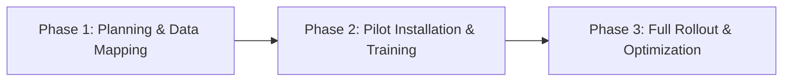

# POS Software for Grocery Store: Complete Guide to Selection, Implementation, and Compliance

Grocery retailers must decide which point‑of‑sale platform will handle high‑volume transactions, perishable inventory, and Pakistani tax requirements without disrupting daily sales. The choice POS Software for Grocery Store directly impacts checkout speed, stock accuracy, profit margins, and the ability to scale across multiple locations. For growing retailers, POS Software for Grocery Store needs to remain dependable as product ranges, order volumes, and fulfilment locations increase.

---

## Core Functional Requirements

A grocery environment differs from a boutique or restaurant in three fundamental ways: rapid item entry, frequent price changes, and the need for precise stock tracking across fast‑moving categories. When evaluating POS Software for Grocery Store that the system provides:

1. **Barcode scanning with bulk‑edit capability** – Scanning must support multiple barcodes per product (e.g., different pack sizes) and allow rapid price overrides during promotions.  
2. **Real‑time stock deduction** – Each sale must instantly reduce inventory counts to prevent over‑selling.  
3. **Batch and expiry management** – Perishable goods require FIFO or FEFO logic, with alerts before items reach their sell‑by date.  
4. **Multi‑payment handling** – Cash, card, mobile wallets (JazzCash, EasyPaisa), and split‑payment options must be processed in a single transaction.  
5. **Udhaar/credit customer accounts** – Many Pakistani shoppers purchase on credit; the POS must track outstanding balances and generate reminder notices.

SadaHisab’s platform includes all of these capabilities out of the box, offering a single dashboard where sales, inventory, and credit management intersect. A clear owner for each POS Software for Grocery Store workflow makes it easier to resolve mismatches before they affect customers or financial reports.

---

## Inventory Management Specifics

Grocery inventories are dynamic; a single aisle can contain hundreds of SKUs that turn over multiple times per day. POS Software for Grocery Store should support:

### a. Centralized Item Master  
Create a master list with fields for SKU, barcode, unit of measure, purchase price, retail price, tax code, and supplier. SadaHisab enables bulk import via CSV, reducing the time required to onboard thousands of products.

### b. Low‑Stock Alerts and Automated Reordering  
Set threshold levels per item. When stock falls below the threshold, the system can generate a purchase order to the preferred vendor, optionally auto‑sending it via email. This prevents stock‑outs during peak shopping hours.

### c. Supplier Integration  
Link each product to a vendor profile, storing contract terms, lead times, and preferred payment methods. When a purchase order is created, the POS can pull the latest purchase price, ensuring accurate cost of goods sold (COGS) calculations.

### d. Shelf‑Life Tracking  
Attach an expiry date to each batch. The POS will flag items approaching expiry, allowing managers to apply markdowns or move stock to discount sections. This reduces waste and improves compliance with Pakistan’s food safety standards.

---

## Pricing, Discounts, and Udhaar Management

Grocery pricing is fluid; promotions, seasonal discounts, and loyalty offers change POS Software for Grocery Store must allow:

* **Dynamic price tiers** – Different prices for bulk purchases (e.g., 5 kg pack vs. 1 kg pack).  
* **Time‑based promotions** – Set start and end dates for discounts, automatically applying the reduced price at checkout.  
* **Loyalty points** – Accumulate points per transaction, redeemable against future purchases.  
* **Udhaar ledger** – Record credit sales against a customer profile, calculate interest if applicable, and generate periodic statements.

SadaHisab’s loyalty engine integrates with the sales screen, showing available points and allowing cash‑or‑point redemption without leaving the checkout flow.

---

## Integration with Accounting, Tax, and Digital Invoicing

In Pakistan, GST (or sales tax) compliance requires accurate, time‑stamped invoices and periodic filing with the Federal Board of Revenue POS Software for Grocery Store should:

1. **Generate digital tax invoices** that include the supplier’s NTN, buyer’s CNIC (if required), and item‑level tax breakdowns.  
2. **Sync automatically with the accounting module** – Sales, purchases, expenses, and tax liabilities must flow into the general ledger without manual entry.  
3. **Support e‑invoicing standards** – The system should be capable of exporting XML or JSON files compatible with the FBR’s e‑invoicing gateway.

SadaHisab offers built‑in digital invoicing that complies with the FBR’s latest guidelines (2026 version). Exported invoices can be uploaded directly to the FBR portal, reducing the risk of manual errors.

External reference: For the official e‑invoicing specifications, see the FBR website [https://www.fbr.gov.pk/](https://www.fbr.gov.pk/).

---

## Multi‑Branch and User Management

A growing grocery chain needs consistent data across POS Software for Grocery Store must handle:

* **Centralized master data** – All branches share the same item master, pricing rules, and tax configurations.  
* **Branch‑specific stock levels** – Each outlet maintains its own inventory counts while still pulling from the central catalogue.  
* **Role‑based access** – Cashiers, floor managers, accountants, and owners require different permissions.  
* **Attendance and payroll integration** – Clock‑in/out data captured at the POS can feed directly into payroll calculations.

SadaHisab’s multi‑branch architecture stores data in a cloud‑based repository, ensuring real‑time visibility of sales trends, profit margins, and inventory health across the network. The transition to POS Software for Grocery Store should include checks for duplicate products, inconsistent prices, and missing stock before live orders are enabled.

---

## Choosing a Vendor: Practical Evaluation Checklist

When the decision hinges on selecting the POS Software for Grocery Store, use the following checklist to compare vendors objectively:

| Criterion | Why It Matters | Typical Evaluation Method |
|-----------|----------------|---------------------------|
| **Scalability** | Ability to add new registers, locations, and SKUs without performance degradation. | Load‑test with simulated peak transactions (e.g., 200 sales/min). |
| **Local Tax Compliance** | Must generate invoices that meet FBR regulations. | Verify sample invoices against FBR templates; request compliance certificate. |
| **Hardware Compatibility** | Works with existing barcode scanners, receipt printers, and cash drawers. | Conduct a hardware compatibility test in a pilot store. |
| **Udhaar Feature Set** | Credit sales are common; system must track balances accurately. | Simulate a credit sale, generate statement, and verify interest calculations. |
| **Integration APIs** | Ability to connect with e‑commerce platforms or third‑party accounting tools. | Review API documentation; test a simple data push (e.g., new product). |
| **Support SLA** | Downtime directly reduces revenue; fast support is essential. | Ask for response time guarantees; check customer testimonials. |
| **Total Cost of Ownership** | Includes subscription, hardware, implementation, and training. | Request a detailed quote and calculate 3‑year ROI based on projected efficiency gains. |

SadaHisab meets each of these criteria, offering a cloud‑native solution with a 99.9 % uptime SLA, dedicated local support, and a transparent pricing model.

---

## Implementation Roadmap

A structured rollout minimizes disruption. Below is a typical three‑phase plan for POS Software for Grocery Store:

### Phase 1 – Planning & Data Mapping  
* **Audit existing inventory** – Export current stock list, clean duplicate SKUs, and map to the new system’s fields.  
* **Define tax codes** – Align product categories with the applicable GST rates (5 % or 0 % for essential items).  
* **Set up user roles** – Create accounts for cashiers, managers, and accountants with appropriate permissions.

### Phase 2 – Pilot Installation & Training  
* Install the POS at a single low‑traffic location.  
* Conduct hands‑on training for cashiers, focusing on barcode scanning, price overrides, and credit sales entry.  
* Run parallel processing for 2 weeks: record sales in both the old and new systems to verify data integrity.

### Phase 3 – Full Rollout & Optimization  
* Deploy the system to all remaining stores, using the refined configuration from the pilot.  
* Enable automated low‑stock alerts and batch expiry notifications.  
* Review daily sales reports for the first month, adjusting pricing rules or discount structures as needed.

Throughout the rollout, maintain a **change‑log** and schedule weekly check‑ins with the implementation team to address emerging issues promptly.

---

## Ongoing Support, Updates, and Training

Even after a successful launch, grocery operators must plan for continuous improvement:

* **Software updates** – SadaHisab releases quarterly patches that incorporate regulatory changes (e.g., updated GST slabs) and new features such as AI‑driven demand forecasting.  
* **Dedicated account manager** – A single point of contact coordinates feature requests, training refreshers, and performance reviews.  
* **Self‑service knowledge base** – Video tutorials, step‑by‑step guides, and FAQs are available 24 / 7, reducing reliance on phone support.  
* **Performance monitoring** – Built‑in analytics track average checkout time, transaction error rates, and inventory turnover, allowing managers to act on data‑driven insights.

For any unanswered question, SadaHisab encourages users to **[Book a free demo](https://sadahisab.com/contact-us/)**, where a specialist can walk through specific workflows.

---

## Frequently Asked Questions

1. **Can the POS handle multiple tax rates for different product categories?**  
   Yes. The system lets you assign a tax code to each SKU, supporting the standard 5 % GST, zero‑rated essentials, and any custom rates introduced by the FBR.

2. **Is it possible to integrate the POS with an existing ERP or accounting software?**  
   SadaHisab provides RESTful APIs that enable bi‑directional data flow with popular ERP platforms. You can sync sales, purchases, and inventory in real time.

3. **How does the system manage credit customers who purchase on Udhaar?**  
   Each credit transaction is recorded against the customer’s profile. The POS calculates outstanding balances, applies optional interest, and can generate printable or digital statements for monthly review.

4. **What hardware is required for a typical grocery checkout?**  
   A barcode scanner (laser or imaging), receipt printer (thermal), cash drawer, and optionally a weight scale for produce. SadaHisab is hardware‑agnostic and works with most off‑the‑shelf devices.

5. **Does the POS support e‑commerce order fulfillment for grocery delivery services?**  
   Yes. Through its API, the POS can receive online orders, deduct inventory automatically, and print pick‑lists for the fulfillment team. For a deeper look at e‑commerce integration, see the SadaHisab page on **[POS Software for Wholesale Business](https://sadahisab.com/industries/pos-software-for-wholesale-business/)**.

---

## Related Resources

- [Pos Software For Auto Spare Parts](https://sadahisab.com/industries/pos-software-for-auto-spare-parts/)
- [Point of sale (Wikipedia)](https://en.wikipedia.org/wiki/Point_of_sale)
- [SRB official website](https://srb.gos.pk/)

## Conclusion

Choosing the POS Software for Grocery Store is a strategic decision that influences every aspect of daily operations—from checkout speed and inventory accuracy to tax compliance and credit management. By focusing on core functionalities such as real‑time stock deduction, batch expiry tracking, and integrated digital invoicing, grocery owners can eliminate manual errors, reduce waste, and improve cash flow. The day-to-day test for POS Software for Grocery Store is simple: a change made in one channel should reach the right records without avoidable manual copying.

SadaHisab delivers a comprehensive, cloud‑native solution that aligns with Pakistani regulatory requirements, supports multi‑branch growth, and offers robust Udhaar features essential for the local market. Following the evaluation checklist and implementation roadmap outlined above will help you transition smoothly, minimize disruption, and realize measurable efficiency gains within the first quarter of operation. The practical benefit of POS Software for Grocery Store is strongest when it supports the existing team instead of forcing every process into an unfamiliar routine.

For a personalized walkthrough of POS Software for Grocery Store can be configured for your specific layout and product mix, **[Book a free demo](https://sadahisab.com/contact-us/)** today.

