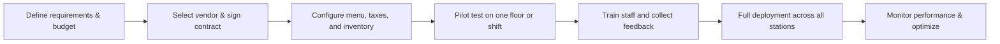

# Comparing Top Restaurant POS Solutions: Pricing, Integration, and Support

Restaurant owners in Pakistan face a decisive question: which POS software will reliably handle high‑volume orders, synchronize kitchen tickets, manage inventory, and stay compliant with local tax regulations while fitting a tight budget? Selecting the right system determines daily operational speed, staff productivity, and ultimately profit margins.

## Core functional requirements for POS Software for Restaurant POS must do more than register a sale. It should:

* **Order capture** – fast touchscreen entry, table mapping, split checks, and modifiers for toppings or dietary preferences.  
* **Kitchen display integration** – instant ticket push to a kitchen display system (KDS) or printer, reducing order latency and errors.  
* **Real‑time inventory tracking** – each dish deducts raw material quantities, triggering low‑stock alerts before a shortage impacts service.  
* **Digital invoicing and tax compliance** – generate GST‑compliant invoices that integrate with the Federal Board of Revenue (FBR) portal.  
* **Analytics** – sales by item, peak hours, labor cost percentages, and waste reports that inform menu engineering.  

SadaHisab’s POS module includes all of these capabilities, plus a built‑in loyalty program and CRM that let you target repeat diners with personalized offers. When evaluating any POS Software for Restaurant that each of the above features is either native or available through a proven third‑party integration. The practical benefit of POS Software for Restaurant is strongest when it supports the existing team instead of forcing every process into an unfamiliar routine.

## Pricing structures and total cost of ownership  

Pricing is the most visible differentiator, but the total cost of ownership (TCO) expands beyond the headline subscription fee.

| Pricing model | Typical monthly range (PKR) | What’s included | Hidden costs to watch |
|---------------|----------------------------|-----------------|-----------------------|
| **Per‑seat subscription** | 1,500 – 3,500 per terminal | Core POS, basic reporting | Additional fees for extra kitchen stations, advanced analytics |
| **Tiered user licensing** | 8,000 – 20,000 for up to 5 users | Multi‑branch support, inventory, digital invoicing | Per‑transaction surcharge for credit‑card processing |
| **Flat‑rate enterprise** | 30,000 – 60,000 for unlimited users | Full ERP integration, API access, 24/7 support | Custom implementation consulting fees |

When calculating TCO, include:

* **Hardware amortization** – tablets, receipt printers, barcode scanners, and KDS screens.  
* **Transaction fees** – most Pakistani banks charge 2 % + PKR 2 per credit‑card transaction; some POS vendors embed this cost into the subscription.  
* **Training and onboarding** – a well‑structured rollout can reduce staff errors that cost time and money.  
* **Support SLA** – higher‑priced plans often guarantee 1‑hour response times, which can be critical during peak dinner service.

SadaHisab offers a transparent per‑seat model with no hidden per‑transaction fees, and a flat‑rate option for chains that prefer predictable budgeting.

## Integration with kitchen, inventory, and e‑commerce  

Seamless integration distinguishes a robust POS Software for Restaurant a standalone cash register.

### Kitchen display and printer support  

A modern restaurant relies on a KDS to route orders directly to cooking stations. The POS should push tickets in real time, allow chefs to mark items as “in progress,” and send alerts when an order is delayed. SadaHisab’s API can connect to popular KDS brands such as QSR Chef and KitchenMate without custom code.

### Inventory and supplier management  

Every time a dish sells, the POS deducts the associated raw materials from the inventory ledger. When stock falls below a predefined threshold, the system can auto‑generate a purchase order to a preferred vendor, complete with batch and expiry tracking – essential for perishable items like meat and dairy. Integration with the POS Software for Restaurant also support barcode scanning for quick stocktakes. A practical review of POS Software for Restaurant should include permissions, staff training, backups, and the support available after launch.

### Online ordering and third‑party delivery  

If the restaurant offers its own website or uses platforms like Foodpanda, the POS must synchronize orders to avoid double‑booking. SadaHisab provides built‑in e‑commerce connectors that pull online orders into the same order queue used by the dining floor, ensuring a single source of truth for sales and inventory. Managers assessing POS Software for Restaurant should review not only features but also transaction history, export options, and the clarity of its reports.

### Accounting and tax compliance  

Pakistan’s GST regime requires digital invoices with specific fields. The POS must export sales data in the format accepted by the FBR’s IRIS portal. SadaHisab’s digital invoicing module automatically includes the mandatory tax identification number (TIN) and generates compliant PDFs that can be uploaded directly to the FBR system.

## Support, training, and service level agreements  

Reliable support protects the restaurant’s revenue flow. When comparing POS Software for Restaurant

* **Availability** – 24/7 phone and live chat support is essential for establishments that operate late into the night.  
* **Response time guarantees** – a 1‑hour on‑site response for critical failures can prevent revenue loss during rush hour.  
* **Knowledge base and training resources** – video tutorials, step‑by‑step guides, and a dedicated onboarding specialist reduce the learning curve.  
* **Update policy** – regular software updates should introduce new features (e.g., contactless payment) without disrupting operations.

SadaHisab offers a tiered support plan: the basic package includes email support within 24 hours, while the premium tier provides 24/7 phone assistance, a dedicated account manager, and quarterly system health reviews.

## Practical evaluation checklist  

Before committing to any POS Software for Restaurant through this checklist:

1. **Feature match** – Does the system support table management, split billing, modifiers, and loyalty programs?  
2. **Hardware compatibility** – Verify that existing tablets or POS terminals are supported, or budget for recommended devices.  
3. **Integration depth** – Confirm API availability for inventory, KDS, accounting, and online ordering platforms.  
4. **Pricing transparency** – Request a detailed quote that lists subscription, hardware, implementation, and any per‑transaction fees.  
5. **Compliance** – Ensure the invoicing module meets FBR GST requirements.  
6. **Support SLA** – Review response time guarantees and escalation procedures.  
7. **Scalability** – Check multi‑branch management features if you plan to expand.  
8. **Reference checks** – Speak with at least two current restaurant customers using the system.

Use this checklist as a scoring matrix; assign weights based on your operational priorities (e.g., integration may be worth 30 % of the total score for a delivery‑heavy concept).

## Implementation roadmap for POS Software for Restaurant disciplined rollout minimizes disruption:

1. **Define requirements & budget** – Map out peak service times, expected order volume, and necessary hardware.  
2. **Select vendor & sign contract** – Use the evaluation checklist to negotiate pricing and support terms.  
3. **Configure menu, taxes, and inventory** – Input every SKU, assign cost centers, and set low‑stock alerts.  
4. **Pilot test** – Run the system on a single dining area for one week, tracking order latency and error rates.  
5. **Train staff** – Conduct hands‑on workshops; SadaHisab provides a “train‑the‑trainer” session that equips a lead server to coach peers.  
6. **Full deployment** – Roll out to all terminals, enable kitchen display integration, and switch to digital invoicing.  
7. **Monitor performance** – Use built‑in analytics to compare pre‑ and post‑implementation metrics such as average ticket time and waste percentage.

A structured rollout typically takes 4‑6 weeks for a single‑site restaurant and 8‑12 weeks for a multi‑branch chain.

## Frequently asked questions  

**1. Can POS Software for Restaurant both dine‑in and takeaway orders on the same device?**  
Yes. Most modern POS solutions, including SadaHisab, let you toggle between table‑based and counter‑based modes, preserving a unified sales ledger.

**2. How does the system manage per‑item ingredient costing?**  
When you define a recipe, you assign each ingredient a cost and quantity. The POS automatically deducts those quantities on sale and recalculates the cost of goods sold (COGS) for profit analysis.

**3. Is it possible to integrate the POS with existing accounting software like QuickBooks?**  
Through open APIs, SadaHisab can push daily sales summaries and expense data to QuickBooks, Xero, or local accounting packages, ensuring a single source of truth for financial reporting.

**4. What security standards protect cardholder data in the POS Software for Restaurant software complies with PCI‑DSS Level 1 requirements, encrypts all transmission, and supports tokenization for stored card details.

**5. How can I evaluate the ROI of switching to a new POS system?**  
Measure baseline metrics (average order time, order error rate, inventory shrinkage) before implementation, then compare after three months. A typical restaurant sees a 10‑15 % reduction in order errors and a 5‑7 % improvement in inventory turnover, translating into measurable profit gains.

For a deeper dive into industry‑specific features, visit our dedicated [restaurant POS system page](https://sadahisab.com/industries/restaurant-pos-system-software/). To discuss your unique needs, feel free to [Book a free demo](https://sadahisab.com/contact-us/).

## Related Resources

- [Pos Software For Grocery Store](https://sadahisab.com/industries/pos-software-for-grocery-store/)
- [Pos Software For Gym](https://sadahisab.com/industries/pos-software-for-gym/)
- [Point of sale (Wikipedia)](https://en.wikipedia.org/wiki/Point_of_sale)
- [FBR official website](https://www.fbr.gov.pk/)
- [SRB official website](https://srb.gos.pk/)

## Conclusion  

Choosing the right POS Software for Restaurant a strategic investment that influences every facet of the dining experience—from the moment a guest scans a QR code to the final profit‑and‑loss statement. By scrutinizing pricing models, confirming seamless integration with kitchen, inventory, and e‑commerce channels, and demanding robust support guarantees, owners can select a solution that scales with their vision. SadaHisab’s comprehensive platform meets these criteria, offering transparent pricing, deep API connectivity, and a support structure tailored to the fast‑paced Pakistani restaurant market. Apply the evaluation checklist, follow the implementation roadmap, and you’ll transform order capture into a reliable engine of growth. Businesses get more value from POS Software for Restaurant when the setup reflects their actual branches, sales channels, tax process, and fulfilment responsibilities.

